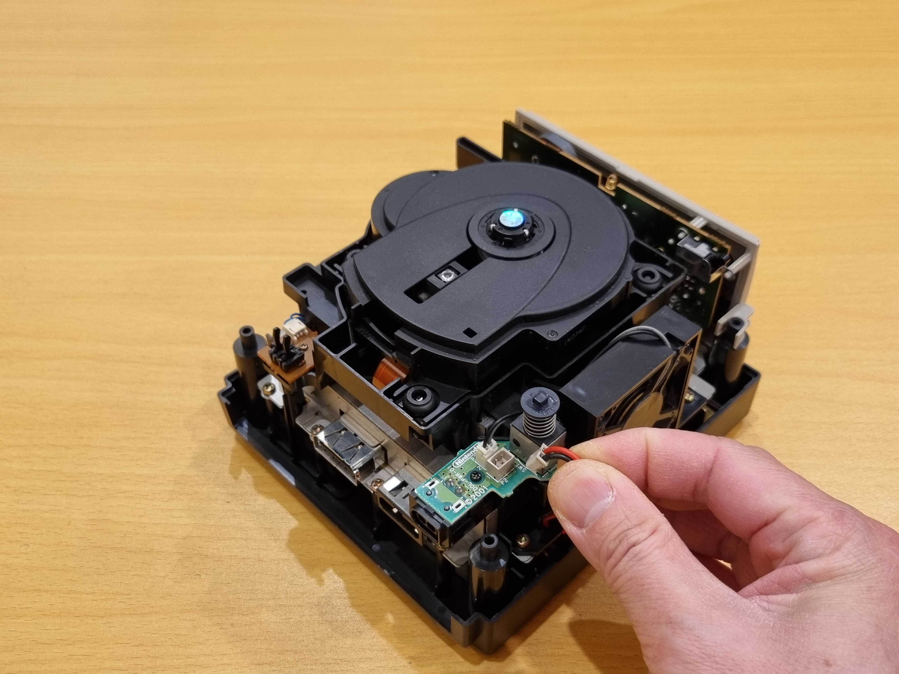

# Power Dolphin Installation Guide

Thank you for purchasing **Power Dolphin🐬**!  
This mod allows you to power your Nintendo GameCube using modern USB-C chargers that support **PD (Power Delivery)** or **QC (Quick Charge)** at 12 V.  
This guide will walk you through testing and installing Power Dolphin on your GameCube.

---

## Prerequisites

You will need:

- A **Gamebit screwdriver** to open the GameCube shell  
- A **USB-C charger** that supports PD or QC at **12 V / 3 A**  
  (see [Troubleshooting](#troubleshooting) for compatibility details)  
- A **small Phillips screwdriver (PH0)** to secure the Power Dolphin power board  
- *(Optional)* **Fine-tip tweezers**, which can make some steps easier  

---

## Test Your USB-C Charger with Power Dolphin

Before opening your GameCube, verify that your charger is compatible:

1. Plug the charger into the wall.  
2. Connect a USB-C cable from the charger to the Power Dolphin board.  

A **green LED** should light up within a few seconds.  
This means your charger successfully negotiated **12 V output**, which is what the GameCube requires.

If the LED **doesn’t light up**:
- Check the specifications printed on your charger — it may not support 12 V output.  
- Some cheap USB-C cables lack the **data wires** required for Power Dolphin to negotiate PD/QC, and therefore won’t work.

More compatibility details can be found in the [Troubleshooting](#troubleshooting) section.

---

## Installation

If your charger passes the test, you can proceed to install Power Dolphin.

1. Use the Gamebit screwdriver to remove the **four long screws** from the bottom corners of the GameCube.  
   

2. Carefully flip the console over and lift off the **top shell**.  
   

3. Tilt and pull the **black back cover** outward.  
   

4. Turn the GameCube so the **back side** faces you.  
   

5. Gently unplug the two connectors:  
   - The **thicker** one is for power.  
   - The **thinner** one is for the fan.  
   
   

6. Use the PH0 screwdriver to remove the **black screw** in the center of the power board.  
   

7. Lift out the **original power board**.  
   

8. Place the **Power Dolphin board** in the same position.  
   

9. Reinstall the **black screw** to secure the board.  
   

10. Reconnect both the **power** and **fan** connectors to Power Dolphin.  
    - The board includes a **third connector** (center) for **PC-standard fans** (Molex KK 2.54 mm).  
    - If you’re using a fan mod such as a **Noctua 4010**, you can plug it directly into this middle connector.  
    

11. Push the **back cover** gently into place. This completes the lower half of the installation.  
    

12. Next, replace the **original power button** with the **Power Dolphin button**:  
    - From the inside of the top shell, gently push the button out using tweezers, a screwdriver, or your fingers.  
      
      
    - From the top side, align and push in the new Power Dolphin button.  
      
      

13. Before reattaching the top shell, make sure:
    1. The **power wires** are tucked into their groove.  
       
    2. The **fan wires** are also properly routed in their groove.  
       

14. Reinstall the top shell. Ensure that all **four corners** sit evenly on the bottom shell.  
    
    

15. Carefully flip the GameCube over and reinstall the **four long Gamebit screws**.  
    

16. **Tada! 🎉** Your Power Dolphin installation is complete.  
    
    

---

## Troubleshooting

If the **green LED** on the Power Dolphin doesn’t light up, it means the board couldn’t negotiate a **12 V output** from your USB-C PD/QC charger.  

Many chargers don’t clearly state which voltages and currents each port supports — even reputable brands like **Belkin**, **Anker**, or **Ugreen**.  
Always check the **label on the charger**, which usually lists exact specifications, such as:

Even with a proper charger, not all **ports** provide the same power.  
In the example above:
- **USB-C1** and **USB-C2** output **12 V / 3 A** ✅  
- **USB-C3** outputs **12 V / 2.5 A** (minimum, not recommended) ⚠️  
- **USB-A** outputs **12 V / 1.5 A** (insufficient — may fail to power on or read discs) ❌  

Therefore, for this charger, only **USB-C1** and **USB-C2** should be used with the GameCube.

**In short, use a charger and port that provide:**  
- **Voltage:** exactly **12 V**  
- **Current:** at least **2.5 A** (3 A or higher recommended)

---

### Cable Compatibility

Some cheap USB-C cables only include **two or four wires** (so-called “charging-only” cables).  
These cables can only deliver **5 V** and lack the data lines required for PD/QC negotiation.  
Avoid using them.

---

### USB-C Port Cover

If the **3D-printed USB-C port cover** came loose during shipping, simply press it back in place as shown below:

